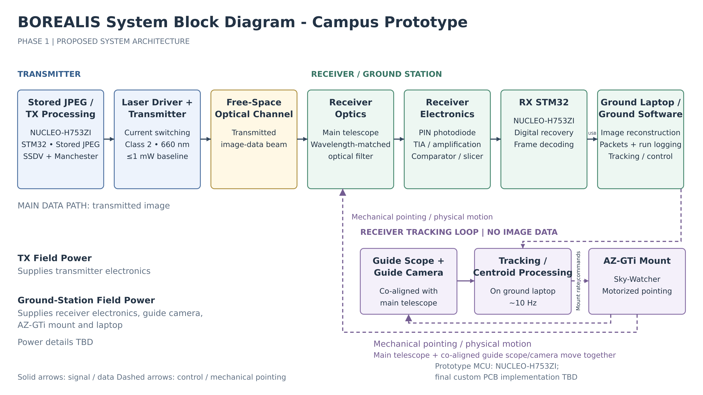
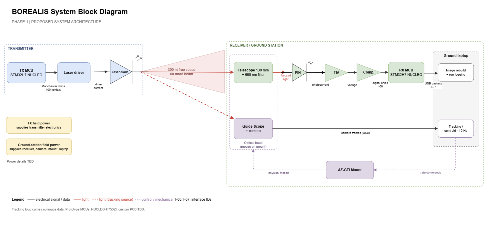

# BOREALIS - Free-Space Optical Data Link with Autonomous Tracking 

BOREALIS is an ongoing senior Electrical and Computer Engineering capstone project at Concordia University focused on developing a free-space optical communication system capable of transmitting image data through a laser link while autonomously acquiring and tracking a moving transmitter.

The project is being developed by a six-member ELEC/COEN 490 team and will progress from subsystem design and bench testing to indoor and outdoor system integration and performance testing.

## Project Status

**Status:** Ongoing  
**Course:** ELEC/COEN 490 Capstone Project  
**Institution:** Concordia University  
**Development period:** 2026-2027

The current Phase 1 design uses a 660 nm Class 2 optical transmitter with STM32-based processing, a photodiode receiver front end, and a separate camera-based acquisition and tracking system.

The graded system currently targets:

- Stationary optical communication over at least 200 m, with a 300 m target
- Moving transmitter tracking over at least 150 m, with a 200 m target
- Autonomous acquisition and reacquisition
- Image transmission and reconstruction
- Measured BER, packet loss, goodput, outage time, and tracking performance
- Indoor testing using calibrated attenuation to reproduce outdoor link conditions

An optional higher-power Class 3B upgrade is also being investigated as a future path toward a 1 km stationary optical link, subject to the required university safety approval.

## System Architecture

The current proposed campus prototype separates the main optical data path from the receiver tracking loop.



### Main Data Path

The primary communication chain consists of:

1. Stored JPEG image processing on an STM32H7 Nucleo
2. SSDV packetization and Manchester encoding
3. Laser-driver and 660 nm optical transmitter
4. Free-space optical channel
5. Telescope and wavelength-matched optical filtering
6. PIN photodiode receiver
7. Transimpedance amplification and signal conditioning
8. Comparator and digital recovery
9. STM32 receiver processing
10. Ground-station image reconstruction and run logging

### Tracking System

A separate co-aligned guide scope and camera are used for target detection and tracking. Camera data is processed on the ground laptop, which generates commands for a motorized telescope mount.

This tracking loop is independent of the image-data path and is intended to support autonomous acquisition, tracking, loss-of-signal recovery, and reacquisition.

## Phase 1 System Block Diagram

The original Phase 1 system block diagram is shown below.



This architecture will continue to evolve as individual subsystems are designed, simulated, built, characterized, and integrated.

## My Responsibilities

My work within the BOREALIS team is focused primarily on electrical hardware, power, and system integration, including:

- Laser-driver development
- Field-power system development
- Receiver front-end integration and characterization
- PCB power architecture review
- Carrier and field integration
- Hardware testing and system-level integration

I also support development and testing of the photodiode receiver chain, including the analog front end and its integration with the rest of the communication system.

## Technologies and Engineering Areas

- Free-Space Optical Communication
- Optical Communications
- Analog Electronics
- Power Electronics
- Embedded Systems
- STM32
- Photodiode Receiver Design
- Transimpedance Amplifiers
- PCB Design
- Control Systems
- Autonomous Tracking
- Hardware Integration
- System Testing and Characterization

## Repository Structure

```text
BOREALIS-Free-Space-Optical-Link/
├── docs/
├── firmware/
├── hardware/
├── media/
│   ├── borealis-campus-prototype-architecture.png
│   └── borealis-phase1-system-block-diagram.png
├── software/
└── README.md
